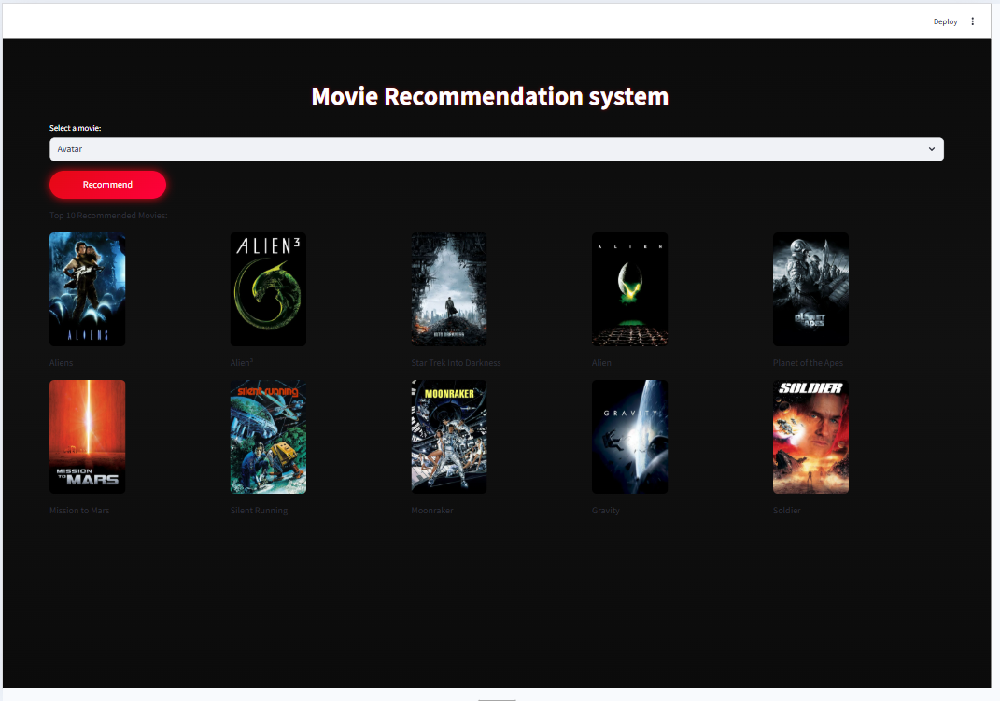

# 🎬 Movie Recommendation System  
  

A **content-based Movie Recommendation System** that suggests movies similar to the one you love — built using **Python, Machine Learning, and Streamlit**, and deployed as an interactive web app.

---

## 🌟 Project Highlights

🎥 Recommends **Top 10 similar movies**  
🧠 Uses **Cosine Similarity** for recommendations  
📊 Built on **TMDB 5000 Movies Dataset**  
🎨 Clean & interactive **Streamlit UI**  
🚀 Deployed using **Streamlit Cloud**

---

## 🎞️ Dataset Overview

This project uses the **TMDB 5000 Movie Dataset**, consisting of two main files:

- `tmdb_5000_movies.csv`
- `tmdb_5000_credits.csv`

📌 **Total Movies:** ~5000  
📌 **Source:** The Movie Database (TMDB)

---

## 🔄 Project Workflow (End-to-End)

### 1️⃣ Data Collection
- Loaded TMDB movies and credits datasets
- Selected relevant columns such as:
  - `title`, `overview`, `genres`
  - `keywords`, `cast`, `crew`

---

### 2️⃣ Data Preprocessing 🧹
- Converted JSON-like strings into Python lists
- Extracted:
  - Top 3 actors from cast
  - Director name from crew
- Removed missing & duplicate values
- Applied text normalization:
  - Lowercasing
  - Removing spaces for consistency

---

### 3️⃣ Feature Engineering ⚙️
- Created a **combined feature column** (`tags`) using:
- Used **CountVectorizer** to convert text into numerical vectors

---

### 4️⃣ Similarity Computation 🧮
- Applied **Cosine Similarity** to measure movie closeness
- Stored similarity scores for fast recommendations

---

### 5️⃣ Recommendation Logic 🎯
- User selects a movie
- System finds most similar movies
- Returns **Top 10 recommendations**

---

## 🖥️ Web App with Streamlit

Built a simple yet interactive UI using **Streamlit**:

✨ Dropdown to select a movie  
✨ “Recommend” button  
✨ Displays recommended movie titles dynamically  

---

## 🚀 Deployment

The application is deployed using **Streamlit Cloud**, making it accessible via a browser without any local setup.

### 📸 App Preview

  

---

## 🛠️ Tech Stack

| Category | Tools |
|--------|------|
| Language | Python 🐍 |
| Libraries | Pandas, NumPy, Scikit-learn |
| ML Technique | Cosine Similarity |
| UI | Streamlit |
| Dataset | TMDB 5000 |
| Deployment | Streamlit Cloud |

---

## 📁 Project Structure

> ⚠️ Large `.pkl` files are ignored using `.gitignore` to keep the repository clean.

---

## 🎯 Future Enhancements

 
✨ Include genre & rating filters  
✨ Improve UI with custom themes  
✨ Add collaborative filtering  

---

## 💡 Learning Outcomes

✔️ Real-world ML pipeline  
✔️ Text vectorization & similarity measures  
✔️ End-to-end deployment experience  
✔️ Git & GitHub best practices  

---

## 👩‍💻 Author

**Himani Verma**  
🎓 B.Sc. (Hons.) Computer Science  
💻 Passionate about ML, Data Science & Full-Stack Learning  

🌸 *“Learning by building is the best way to grow.”*

---

⭐ If you like this project, don’t forget to **star the repository**!

